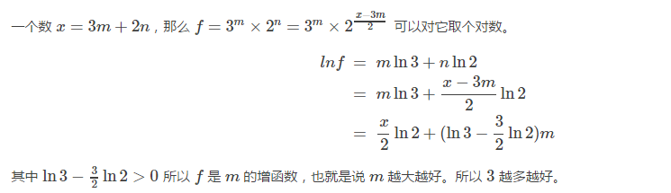

## Integer-Break

## 说明

给一个正数`n`，将它进行因式分解，返回所有的因式中乘积最大的结果

例如

```js
given n = 2, return 1 (2 = 1 + 1);

given n = 10, return 36 (10 = 3 + 3 + 4).
```

- 假设`n >= 2 && n <= 58`

### 思路

- 数学分析，拆出足够多的`3`能使乘积最大

证明：

如果因子`x`大于`4`，那么可以拆分为`x - 2`和`x`，可以证明`(x - 2) * 2 > x`，因此不能大于`4`

如果等于`4`，可有可无（因为可以用`4 = 2 + 2`替代），因此只剩下`2`和`3`

又可以证明`3`比`2`好



```js
如果拆出的因子不限于整数的话，可以证明e=2.718
```

http://blog.csdn.net/liyuanbhu/article/details/51198124